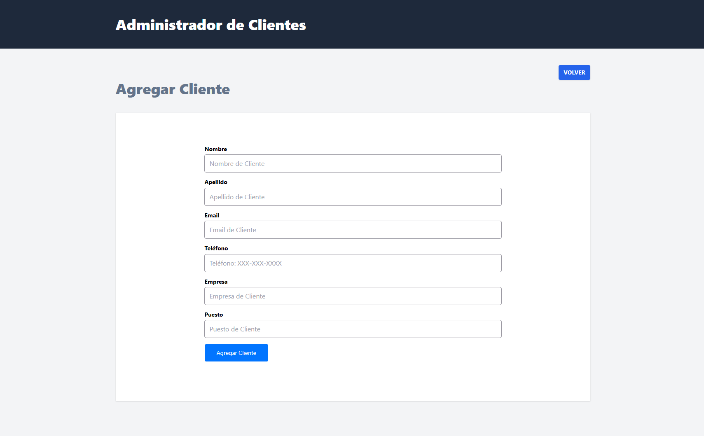

# 👥 CRM de Clientes

Aplicación web para administrar una cartera de clientes. Permite registrar clientes con sus datos de contacto y empresa, consultarlos en una tabla, editarlos, eliminarlos y marcarlos como activos o inactivos con un solo clic.

Está construida con **Vue 3**, **Vue Router**, **Tailwind CSS** y **FormKit**, y consume una **API REST** simulada con [json-server](https://github.com/typicode/json-server) a través de **Axios**.



## ✨ Características

- **Listado de clientes** en una tabla con nombre, email, empresa, puesto y estado.
- **Agregar clientes** mediante un formulario con validaciones.
- **Editar clientes** con el formulario precargado con sus datos actuales.
- **Eliminar clientes** directamente desde el listado.
- **Cambiar el estado** (Activo / Inactivo) haciendo clic sobre la etiqueta del cliente.
- **Validación de formularios con FormKit**: nombre, apellido y email son obligatorios, el email debe tener un formato válido y el teléfono, si se captura, debe seguir el formato `XXX-XXX-XXXX`.
- **Navegación entre vistas** con Vue Router.

## 🛠️ Tecnologías

- [Vue 3](https://vuejs.org/) con Composition API y `<script setup>`
- [Vue Router](https://router.vuejs.org/) para la navegación
- [FormKit](https://formkit.com/) con el tema Genesis para formularios y validaciones
- [Tailwind CSS](https://tailwindcss.com/)
- [Axios](https://axios-http.com/) para las peticiones HTTP
- [json-server](https://github.com/typicode/json-server) como API REST de desarrollo
- [Vite](https://vitejs.dev/) como herramienta de desarrollo y build

## 📋 Requisitos

- [Node.js](https://nodejs.org/) 18 o superior
- npm (incluido con Node.js)

## 🚀 Instalación y uso

1. Clona el repositorio:

   ```bash
   git clone https://github.com/SuemyDzib/crm-vue.git
   cd crm-vue
   ```

2. Instala las dependencias:

   ```bash
   npm install
   ```

3. En una terminal, levanta la API con json-server en el puerto `4000`:

   ```bash
   npx json-server db.json --port 4000
   ```

   La API quedará disponible en `http://localhost:4000/clientes`.

4. En otra terminal, inicia el servidor de desarrollo:

   ```bash
   npm run dev
   ```

5. Abre en tu navegador la URL que muestra la terminal (por defecto `http://localhost:5173`).

> La app necesita que json-server esté corriendo para mostrar y guardar clientes. Si el listado aparece vacío, revisa que la API esté activa en el puerto `4000`.

### Otros scripts

| Comando           | Descripción                                              |
| ----------------- | -------------------------------------------------------- |
| `npm run dev`     | Inicia el servidor de desarrollo con recarga en caliente |
| `npm run build`   | Genera la versión de producción en la carpeta `dist/`    |
| `npm run preview` | Sirve localmente la versión de producción generada       |

## 🔌 Endpoints de la API

La app usa los siguientes endpoints, definidos en `src/services/ClienteService.js`:

| Método   | Endpoint         | Descripción                              |
| -------- | ---------------- | ---------------------------------------- |
| `GET`    | `/clientes`      | Obtiene todos los clientes               |
| `GET`    | `/clientes/:id`  | Obtiene un cliente por su ID             |
| `POST`   | `/clientes`      | Crea un cliente nuevo                    |
| `PATCH`  | `/clientes/:id`  | Actualiza los datos o el estado          |
| `DELETE` | `/clientes/:id`  | Elimina un cliente                       |

Si quieres usar otra API o puerto, cambia la `baseURL` en `src/lib/axios.js`.

### Estructura de un cliente

```json
{
  "id": "1",
  "nombre": "Juan",
  "apellido": "Pérez",
  "email": "juan@correo.com",
  "telefono": "123-123-1234",
  "empresa": "Mi Empresa",
  "puesto": "Desarrollador web",
  "estado": true
}
```

## 🗺️ Rutas

| Ruta                  | Vista                                  |
| --------------------- | -------------------------------------- |
| `/`                   | Listado de clientes                    |
| `/agregar-cliente`    | Formulario para agregar un cliente     |
| `/editar-cliente/:id` | Formulario para editar un cliente      |

## 👤 Autor

Desarrollado por **Suemy Dzib** – [@SuemyDzib](https://github.com/SuemyDzib) a través del curso de Udemy impartido por Juan de la Torre.